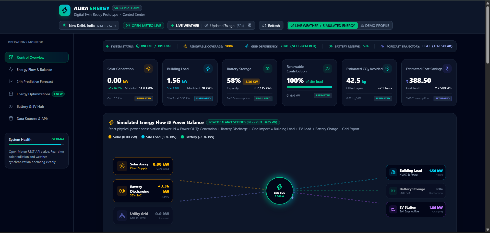

# Aura Energy — Renewable Energy Digital Twin & EMS

> **Hackathon Submission: Software-Only Renewable Energy Digital Twin & Energy Management System**

## Problem Statement

Buildings and campuses with rooftop solar, battery storage, and EV charging need real-time visibility into energy generation, consumption, storage state, and grid interaction — alongside clear decision support for optimal energy management. Existing solutions are either expensive hardware-dependent SCADA systems or generic dashboards without physics-based transparency.

## Solution

Aura Energy is a **software-only Renewable Energy Digital Twin** that combines:
- **Live environmental data** from the Open-Meteo weather API (temperature, cloud cover, solar irradiance)
- **A deterministic energy simulation model** for solar generation, building load, battery storage, EV charging, and grid interaction
- **Physics-informed power balance** (Power IN ≡ Power OUT enforced at every state)
- **24-hour physics-based forecast** using live weather forecast data from Open-Meteo
- **Rule-based energy optimization** with transparent reasoning chains
- **Interactive scenario simulation** for demonstration and testing
## Live Demo

**Live Dashboard:** https://vinayakdevtiwari.github.io/renewable-energy-digital-twin/

## Screenshots

### Main Dashboard



> ⚠️ **Scope Disclosure**: This is a SOFTWARE DIGITAL TWIN. No physical sensors, ESP32 microcontrollers, smart meters, battery BMS, or EV chargers are currently connected. All energy system values are simulated. Only Open-Meteo weather data is genuinely live.

## Key Features

- ✅ Live weather & solar irradiance from Open-Meteo REST API
- ✅ Deterministic solar generation model (diurnal sine curve × cloud attenuation)
- ✅ Physics power balance: Solar + Battery Discharge + Grid Import = Building + EV + Battery Charge + Grid Export
- ✅ 24-hour physics-informed energy forecast
- ✅ Rule-based optimization engine with Condition → Problem → Action → Expected Impact
- ✅ 4-scenario interactive demonstration switcher
- ✅ Transparent data labeling: LIVE / SIMULATED / CALCULATED / ESTIMATED / RULE-BASED
- ✅ Data lineage audit panel

## Architecture

```
Open-Meteo REST API
        │
        ▼
  weatherService.ts         ← Fetch live weather + irradiance
        │
        ▼
  demoDataService.ts        ← Physics simulation engine
  ┌──────────────────────────────────────────────────┐
  │  Solar Model (diurnal × cloud attenuation)       │
  │  Building Load Model (time-of-day profile)       │
  │  Battery Model (SoC, charge/discharge)           │
  │  EV Charging Model (4 simulated bays)            │
  │  Grid Interface (import/export balance)          │
  │  Power Balance Enforcer (IN ≡ OUT)               │
  │  24h Forecast Generator                          │
  │  Rule-Based Optimization Engine                  │
  └──────────────────────────────────────────────────┘
        │
        ▼
  useEnergyData.ts          ← Central state management hook
        │
        ▼
  React Dashboard Components
```

## Data Flow

1. **Weather fetch**: Open-Meteo provides live temperature, cloud cover, wind, irradiance
2. **Solar model**: Converts irradiance + time-of-day into simulated generation (kW)
3. **Demand model**: Time-of-day occupancy profile generates building load (kW)
4. **Power balance**: Net balance drives battery dispatch & grid import/export
5. **Forecast**: 24-hour hourly simulation using Open-Meteo 24h hourly forecast
6. **Optimization**: Rule engine evaluates state and emits ranked recommendations
7. **Dashboard**: All components read from one central shared state

## What Is Live vs Simulated

| Metric | Source | Type |
|--------|--------|------|
| Temperature, Humidity, Wind | Open-Meteo API | **LIVE** |
| Cloud Cover | Open-Meteo API | **LIVE** |
| Solar Irradiance (W/m²) | Open-Meteo API | **LIVE** |
| Solar Generation (kW) | Physics model | **SIMULATED** |
| Building Load (kW) | Demand model | **SIMULATED** |
| Battery SoC, Power | Battery model | **SIMULATED** |
| EV Charging Load | EV model (4 bays) | **SIMULATED** |
| Grid Import/Export | Power balance | **CALCULATED** |
| Renewable Contribution % | Energy balance | **CALCULATED** |
| CO₂ Avoided | Formula: kWh × 0.82 | **ESTIMATED** |
| Cost Savings | Formula: kWh × tariff | **ESTIMATED** |
| Recommendations | Rule engine | **RULE-BASED** |
| 24h Forecast | Physics + weather | **SIMULATED FORECAST** |

## Power Balance Equation

All simulation states satisfy:

```
Power IN  = Solar Generation + Battery Discharge + Grid Import
Power OUT = Building Load + EV Charging + Battery Charge + Grid Export
Power IN ≡ Power OUT  (within ±0.05 kW tolerance)
```

The dashboard displays a real-time **POWER BALANCE VERIFIED** indicator calculated from actual values — never hard-coded.

## Solar Generation Model

```
Solar(kW) = PeakCapacity × sin((hour − 6) / 12 × π)^1.4 × (1 − cloudCover × 0.75)

Peak Capacity: 8.5 kW (configurable)
Daylight window: 06:00 – 18:00
Cloud attenuation: 0–75% reduction
```

## Battery Model

```
SoC range: 15% – 98% (configurable minimum reserve)
Max charge rate: 3.5 kW
Max discharge rate: 4.0 kW
Capacity: 15 kWh reference system
```

## Modeled Daily Energy Totals

Daily totals shown in the dashboard are **not derived from instantaneous kW readings**. They are calculated by integrating the deterministic 24-hour diurnal profile:

- **Solar Daily (kWh)**: Integral of the sine-curve model over daylight hours (6–18h), attenuated by cloud cover
  - Integral of sin((x−6)/12 × π) from 6 to 18 = (12/π) × 2 ≈ 7.64 equivalent full-power hours
  - `Solar Daily = 8.5 kW × 7.64h × cloud_attenuation`
- **Demand Daily (kWh)**: Trapezoid integration of the occupancy profile across 24 hours
- Label shown in UI: **"Modeled: X kWh"** (not "Today:")

## Forecasting Method

The 24-hour forecast is **physics-informed**, not machine-learning predicted:
- Solar: Diurnal sine curve applied to each forecast hour using Open-Meteo hourly cloud forecast
- Demand: Deterministic time-of-day occupancy profile
- Battery SoC: Trajectory estimated from solar surplus/deficit
- Grid: Derived from balance

Label: **"24-Hour Physics-Informed Forecast (Simulated)"**

## Optimization Engine

The optimization engine is **rule-based**, not ML:
- Evaluates net energy balance (solar − load)
- Checks battery SoC against thresholds (15%–98%)
- Checks grid tariff window (base ₹7.50 vs peak ₹9.80/kWh)
- Emits ranked dispatch actions: CHARGE_BATTERY, SCHEDULE_EV, SHIFT_LOAD, EXPORT_GRID
- Each recommendation includes: Condition, Problem, Action, Expected Impact

## Demonstration Scenarios

Four **deterministic demonstration scenarios** are available in Demo Mode:

| Scenario | Effect |
|----------|--------|
| Normal Operation | Standard diurnal solar profile + baseline demand |
| Cloud Cover Event | Solar drops 65% due to dense overcast |
| Demand Surge | Building load spikes to 6.2 kW (HVAC event) |
| EV Fleet Influx | All 4 EV bays simultaneously charging (13.2 kW) |

All scenario values are simulated. Activating a scenario updates the entire dashboard consistently: energy flow, KPIs, battery response, grid state, forecast, timeline, optimization recommendations, and alerts.

## Technology Stack

- **Frontend**: React 19 + TypeScript
- **Build**: Vite 8
- **Charts**: Recharts
- **Icons**: Lucide React
- **Styling**: Tailwind CSS
- **Live Data**: Open-Meteo REST API (free, no API key required)
- **State Management**: React hooks (useEnergyData)

## Project Structure

```
src/
├── components/         # All React UI components
│   ├── EnergyFlowVisualizer.tsx   # Central power balance diagram
│   ├── KPICards.tsx               # Top-level KPI summary
│   ├── Forecast24hSection.tsx     # 24-hour forecast chart
│   ├── AIRecommendations.tsx      # Rule-based optimization panel
│   ├── BatteryStorageCard.tsx     # Battery model status
│   ├── EVChargingCard.tsx         # EV charging hub
│   ├── DataSourcePanel.tsx        # Data lineage audit
│   ├── WeatherSection.tsx         # Live weather display
│   └── SystemHealthStrip.tsx      # Operational status strip
├── services/
│   ├── weatherService.ts          # Open-Meteo API integration
│   ├── demoDataService.ts         # Physics simulation engine
│   └── mlIntegrationService.ts   # Future ML adapter interface
├── hooks/
│   └── useEnergyData.ts           # Central state management
├── types/
│   └── energy.ts                  # All TypeScript interfaces
└── config/
    └── appConfig.ts               # System constants
```

## Installation

```bash
git clone <repo-url>
cd renewable-energy-dashboard
npm install
```

## Run Locally

```bash
npm run dev
```

Open `http://localhost:5173` in your browser.

No API key is required — Open-Meteo is free and open access.

## Environment Variables (Optional)

Create a `.env.local` file:

```env
# Optional: future ML backend endpoints
VITE_ML_FORECAST_ENDPOINT=/api/forecast
VITE_ML_RECOMMENDATIONS_ENDPOINT=/api/recommendations
VITE_ML_ENERGY_STATUS_ENDPOINT=/api/energy-status
```

## Demo Instructions (Judges)

1. Open the dashboard — it immediately loads live weather for New Delhi.
2. Observe the **KPI cards** showing simulated solar, demand, battery, and renewable contribution.
3. Check the **Energy Flow diagram** — confirm "Power Balance Verified" badge.
4. Switch locations (Bengaluru, Mumbai, London, San Francisco, Tokyo) to observe how live weather changes simulation.
5. Enable **Demo Mode** using the header toggle.
6. Activate each scenario to observe live system response:
   - Cloud Cover Event → solar drops, battery discharges, grid imports
   - Demand Surge → grid imports more, battery assists
   - EV Fleet Influx → all 4 bays active, site load increases
7. Visit the **Data Sources** tab to review the data lineage audit.
8. Visit the **Forecast** tab for the 24-hour physics-based forecast.
9. Visit **Energy Optimization** for rule-based recommendations.

## Assumptions & Limitations

- Solar capacity: 8.5 kW peak (configurable in `appConfig.ts`)
- Battery: 15 kWh reference system (simulated, not real BMS)
- Grid tariff: ₹7.50/kWh base, ₹9.80/kWh peak (Indian demo context; configurable)
- CO₂ factor: 0.82 kg/kWh (approximate Indian grid emission factor, CEA 2022)
- EV charging: 4 simulated bays, no real OCPP protocol
- Building demand: Simplified time-of-day occupancy profile
- No historical data accumulation between sessions
- Forecast is deterministic, not ML-predicted

## Future Scope (Hardware Integration Ready)

The architecture supports replacing simulated inputs with real sensor data:

- ESP32 with INA219 → real solar/battery current & voltage
- RS485 Modbus → real building smart meter
- Solar inverter Modbus → real inverter generation telemetry
- Battery BMS → real SoC and cell data
- OCPP-compliant EV charger → real EV charging data
- External ML backend → replace rule-based optimizer with trained model

## Hackathon Context

> Problem Statement: SD-03 — Renewable Energy Optimization Platform
> Submission Type: Software Digital Twin (no hardware)

---

*Built with React, TypeScript, Vite, Recharts, Tailwind CSS, and Open-Meteo.*
